# Configuración del simulador
Después de crear el proyecto de Repast Simphony y tras colocar los archivos indicados en el [README.es.md](https://github.com/RoberCast/Desarrollo_simulaciones_para_estudio_de_FN_RRSS/blob/main/README.es.md#instrucciones) en su lugar correspondiente, se procede a completar la configuración del simulador. Para ello, se realizan los pasos siguientes:

1. **Ejecución del simulador en modo GUI (ejecución única)**. En el IDE Eclipse que se ha instalado con Repast Simphony, se ejecuta *FakeNewsSpreadSim Model*. Se abre el simulador en modo GUI y se procede a su configuración.
  

  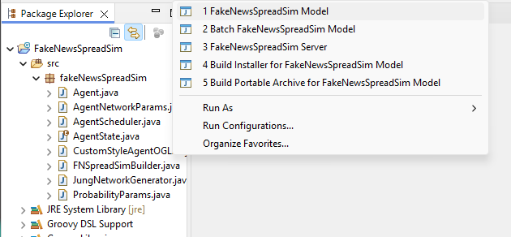

2. **Pestaña Scenario Tree**. Con el simulador abierto, se hace click en la pestaña *Scenario Tree*, que contiene la configuración de la simulación. Los apartados que se pueden configurar son: *Charts*, *Data Loaders*, *Data Sets*, *Displays*, *Text Sinks* y *User Panel*. Se configuran todos ellos excepto *User Panel*.

  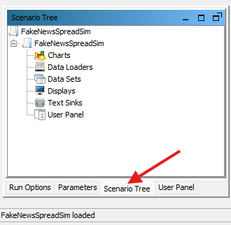

3. **Data Loaders**. Se hace click con el botón derecho en *Data Loaders* y después se hace click en *Set Data Loader*. En la siguiente ventana se elige la opción *Custom ContextBuilder Implementation* y se hace click en *Next*. 
   

  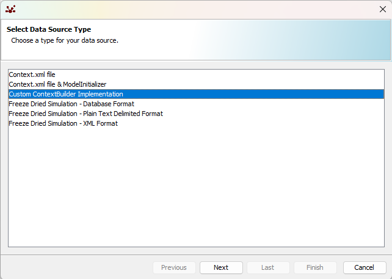

La siguiente ventana no se modifica y se hace click en *Next* y después en *Finish*.

  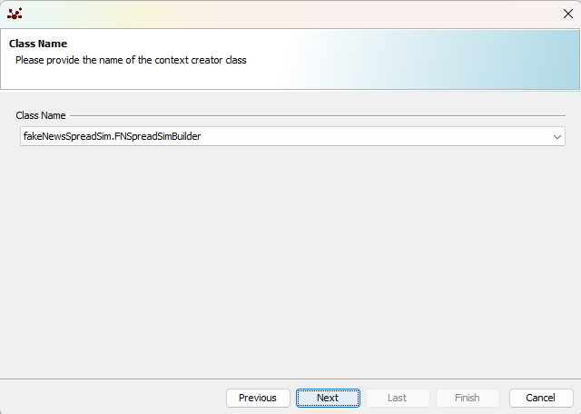

4. **Data Sets**. Se hace click con el botón derecho en *Data Sets* y después se hace click en *Add Data Set*. En la siguiente ventana se le da un nombre al dataset, por ejemplo, *Social Network Data Set*, y se deja *Aggregate* como tipo de dataset. Se hace click en *Next*.

  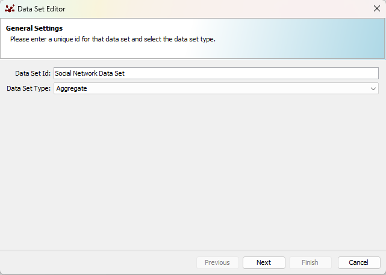

En la siguiente ventana, se pueden observar las pestañas *Standard Sources*, *Method Data Sources* y *Custom Data Sources*. En la pestaña *Standard Sources* se deja marcada la opción *Tick Count*. 

  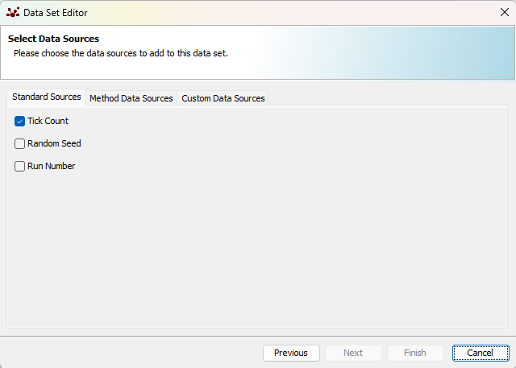

En la pestaña *Method Data Sources* se añade lo siguiente haciendo click en *Add* y haciendo doble click en cada campo para rellenar cada uno de ellos:

  * *Source Name* = Susceptible count, *Agent Type* = Agent, *Method* = isSusceptible y *Aggregate Operation* = sum.
  * *Source Name* = Believer count, *Agent Type* = Agent, *Method* = isBeliever y *Aggregate Operation* = sum.
  * *Source Name* = FactChecker count, *Agent Type* = Agent, *Method* = isFactChecker y *Aggregate Operation* = sum.

  

La pestaña *Custom Data Sources* se deja como está y se hace click en *Next*.

  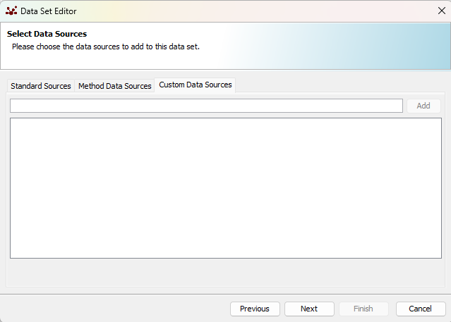

La siguiente ventana se deja como está y se hace click en *Finish*.

  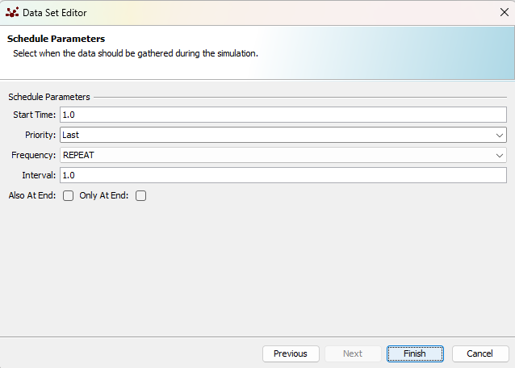

5. **Displays**. Se hace click con el botón derecho en *Displays* y después se hace click en *Add Display*. En la siguiente ventana, se le da un nombre al display, por ejemplo, *Social Network Display*. En las proyecciones, se añaden *Social network* y *space*, en este orden, y se hace click en *Next*.

  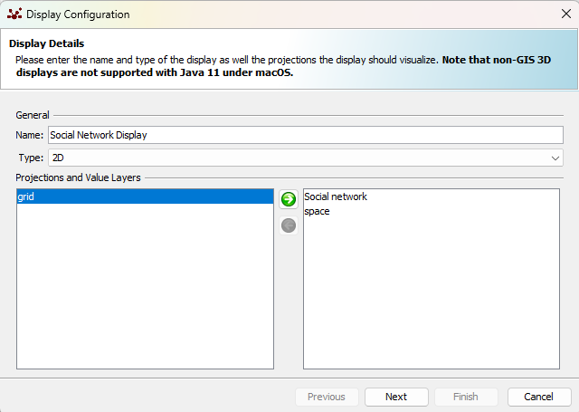

En la siguiente ventana, se añade *Agent* y se hace click en *Next*.

  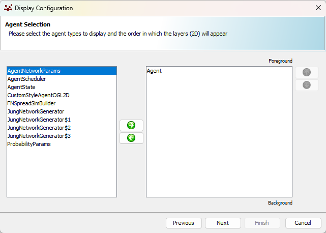

En la siguiente ventana, en *Style Class*, se deja la opción *fakeNewsSpreadSim.CustomStyleAgentOGL2D* y se hace click en *Next*.

  

En la siguiente ventana no se cambia nada y se hace click en *Next*.

  

En la siguiente ventana, se deja la opción *repast.simphony.visualizationOGL2D.DefaultEdgeStyleOGL2D* y se hace click en el boton que se encuentra justo a la derecha de la opción anterior y que sirve para editar el estilo, en este caso de los vértices de la red. En la opción *Edge Thickness* se define *Value* = 0.5 y se cambia el color a gris (por defecto es verde), se hace click en *OK* y después se hace click en *Next*.

  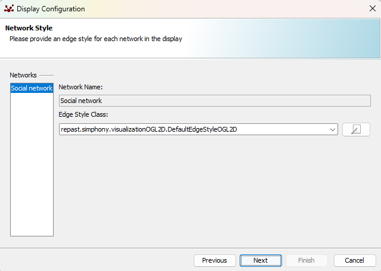

En la siguiente ventana no hay cambios y se hace click en *Finish*.

  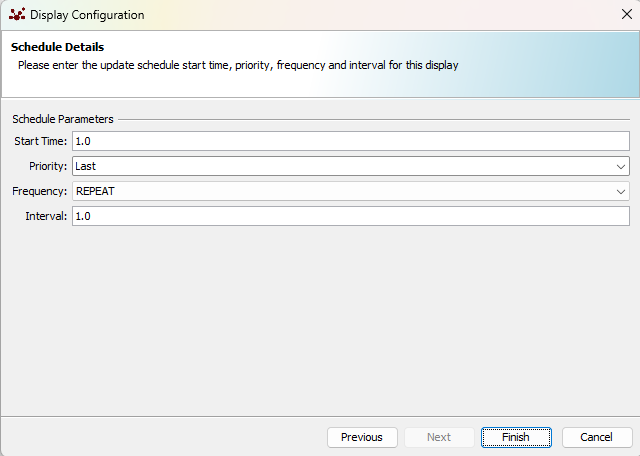

6. **Text Sinks**. Se hace click derecho en *Text Sinks* y después se hace click en *Add File Sink*. En la siguiente ventana, se le da un nombre al *File Sink*, por ejemplo, *File Sink - Count*. Después se elige *tick*, *Susceptible count*, *Believer count* y *FactChecker count*, en ese orden, y se hace click en *Next*.

  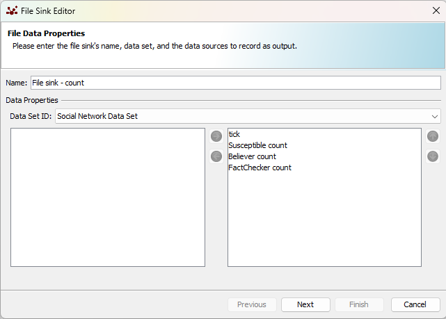

En la siguiente ventana, se elige un nombre para el archivo de salida o se deja el nombre por defecto, en el caso de este manual de configuración se opta por cambiar el nombre a *Model_Output_Data.txt*. Estos archivos de salida se guardan en la carpeta *repast-licences* del proyecto. Después se hace click en *Finish*.

  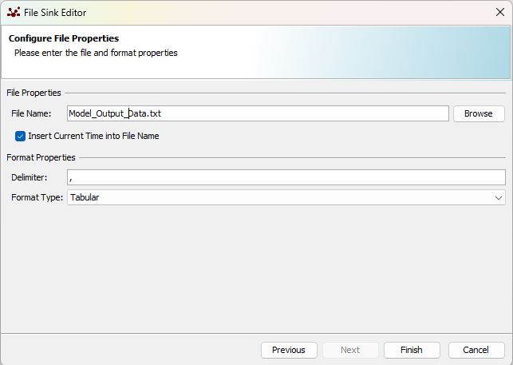

7. **Charts**. Se hace click derecho en *Charts* y después se hace click en *Add Time Series Chart*. En la siguiente ventana, se le da un nombre al gráfico, por ejemplo, *Spread of fake news - Time Series Chart* y se hace click en *Next*.

  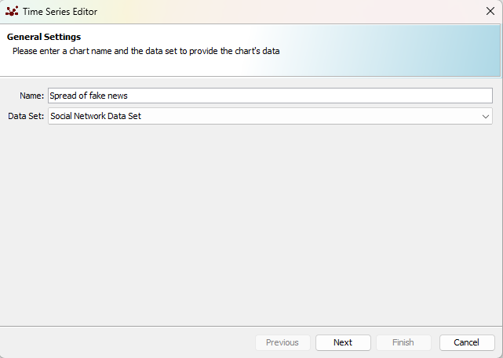

En la siguiente ventana, se marcan *Believer count*, *FactChecker count* y *Susceptible count*. Para ser fieles al modelo SBFC, se eligen los siguientes colores: 

  * Believer = Azul.
  * FactChecker = Rojo.
  * Susceptible = Gris.

Estos colores se pueden cambiar haciendo doble click en el recuadro coloreado. Una vez seleccionados los colores, se hace click en *Next*.

  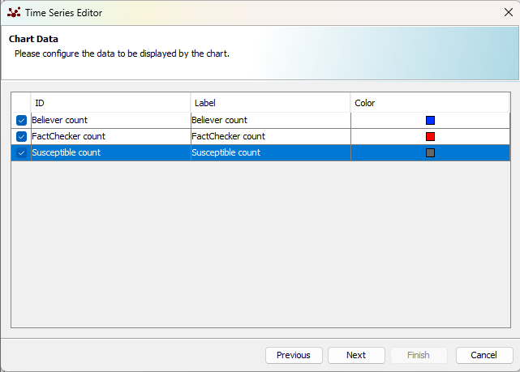

En la siguiente ventana, se le da un título al gráfico, por ejemplo, *State of Agents*. Se elige una etiqueta para el eje Y, por ejemplo, *Agents* y después se hace click en *Finish*.

  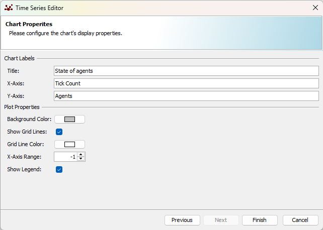

Para finalizar la configuración, es importante que se haga click en el icono del disquete del simulador, 💾. De esta forma se guardará la configuración que se ha introducido.
