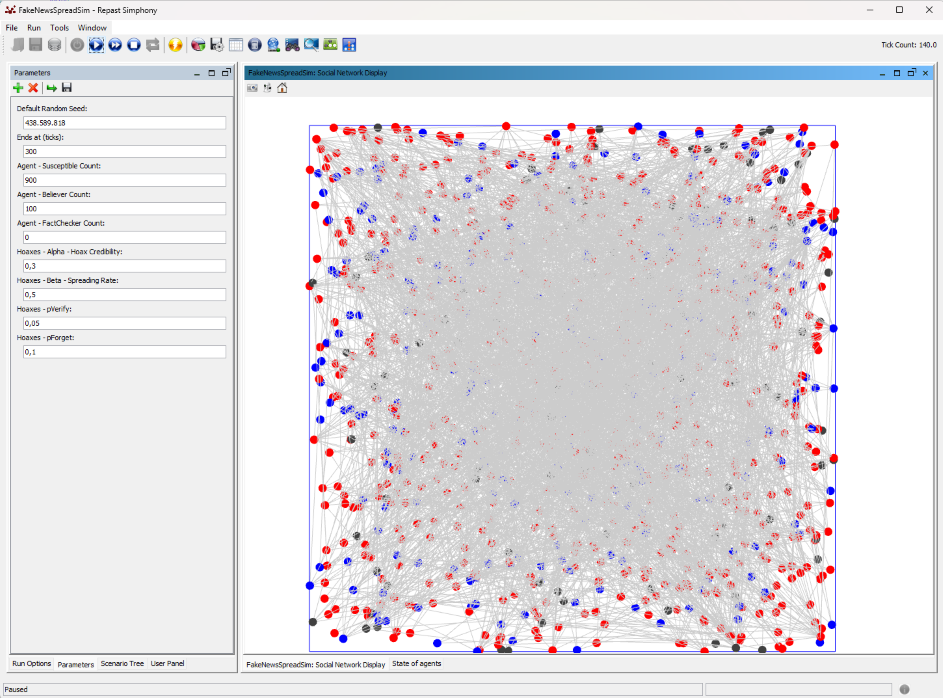
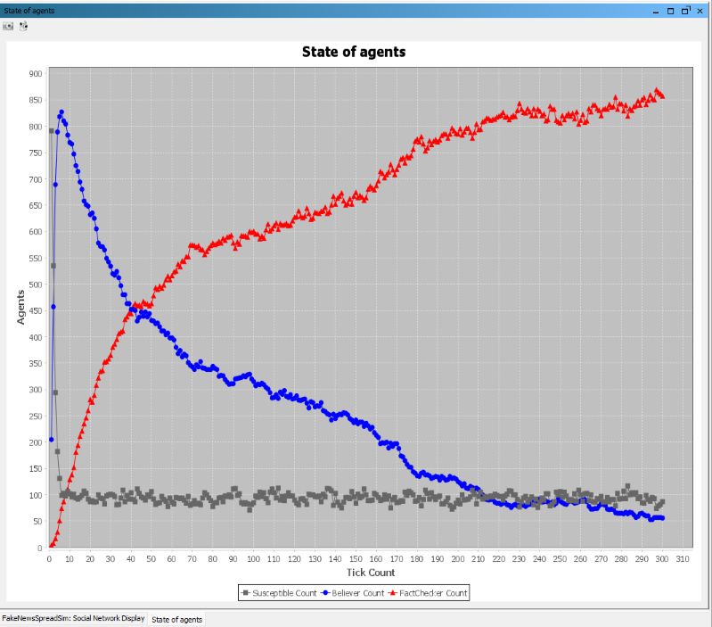
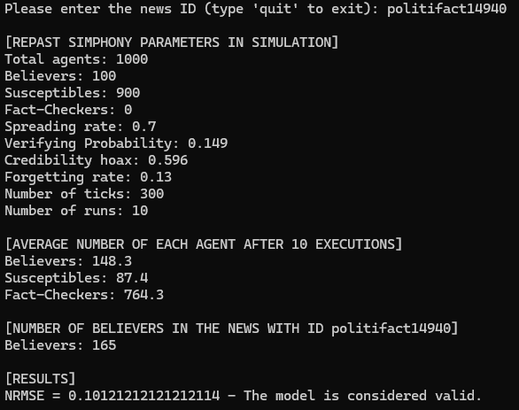

# PFG - Desarrollo de simulaciones para el estudio de la difusión de noticias falsas (fake news) en redes sociales

## Universidad
Universidad Nacional de Educación a Distancia - UNED

Escuela Técnica Superior de Ingeniería Informática

## Curso
2024-2025

## Resumen
Proyecto de fin de grado.

FakeNewsSpreadSim implementa un modelo de difusión de noticias SBFC (Susceptible, Believer, Fact-Checker) para su simulación en Repast Simphony.

DataAnalyzer aplica una metodología de validación que implica la ejecución del modelo 10 veces, hacer el promedio del número de agentes en cada estado posible y calcular el NRMSE para determinar la validez del modelo. El modelo se considera válido si el NRMSE < 0.2. DataAnalyzer puede validar el modelo implementado y ajustarlo a la información observada en una noticia real a partir de un conjunto de datos de difusión de noticias reales.

## Instrucciones
Para simular y validar el modelo o ajustar el modelo a una noticia real a partir de un conjunto de datos reales, debe instalar Repast Simphony 2.11.0 desde su repositorio oficial:

https://repast.github.io/download.html

Una vez instalado el simulador, cree un proyecto Repast Simphony llamado "FakeNewsSpreadSim" y copie los archivos de la carpeta FakeNewsSpreadSim de este repositorio de la siguiente manera:

```bash    
FakeNewsSpreadSim
    ├── src
    │    ├── Agent.java
    |    ├── AgentNetworkParams.java
    |    ├── AgentScheduler.java
    |    ├── AgentState.java
    |    ├── CustomStyleAgentOGL2D.java
    |    ├── FNSpreadSimBuilder.java
    |    ├── JungNetworkGenerator.java
    │    └── ProbabilityParams.java
    |
    ├── batch
    |    └── batch_params.xml
    |
    └── FakeNewsSpreadSim.rs
         ├── context.xml
         └── parameters.xml
```

El archivo parameters.xml contiene los parámetros predeterminados del modelo. Puede ejecutar Repast Simphony en modo GUI (una simulación única) o por lotes. Para validar el modelo o ajustarlo con datos reales, ejecútelo por lotes y seleccione "DataAnalyzer JAR/Resources /repast simphony output" como carpeta de salida. Siga las instrucciones del archivo "DataAnalyzer JAR/Resources/dataset/README.txt" para seleccionar un conjunto de datos válido y colocarlo en la carpeta "dataset", en la misma ruta. Para comprobar qué comandos son válidos en DataAnalyzer, debe ejecutar el archivo DataAnalyzer.jar desde el comando con la opción "-h", esto mostrará la ayuda. Finalmente, DataAnalyzer mostrará el resultado del análisis.

## Imágenes de demostración
A continuación, se muestran imágenes del funcionamiento del modelo de difusión de noticias SBFC en Repast Simphony y de la herramienta de validación DataAnalyzer.

* Ejecución del modelo de difusión de noticias SBFC en Repast Simphony.
  

  
* Estado de los agentes tras una simulación.


  
* Resultado de la validación del ajuste del modelo a una noticia real a partir de un conjunto de datos reales.

  

## Licencia
Este proyecto está licenciado bajo la **Licencia Pública General GNU v3 (GPLv3)**.

© 2025 Roberto Castillejo Embid.
Este repositorio contiene código original desarrollado con fines académicos.
Puede usarlo, modificarlo y redistribuirlo libremente bajo los mismos términos de la licencia (GPLv3).

## Créditos
### Modelo de difusión de noticias
E. Sulis and M. Tambuscio. (2020, Oct.) Simulation of misinformation spreading processes
in social networks: an application with netlogo. Access: 2025-08-14. [Online]. Available:
https://ieeexplore.ieee.org/document/9260064/ 

### Metodología de validación
A. Gausen, W. Luk, and C. Guo. (2021, Jun.) Can we stop fake news? using agent-based
modelling to evaluate countermeasures for misinformation on social media. Access:
2025-08-14. [Online]. Available: https://workshop-proceedings.icwsm.org/pdf/2021_63.pdf

## Cómo citar este trabajo
Si utiliza este proyecto, cítelo utilizando el DOI:

[https://doi.org/10.5281/zenodo.17360338](https://doi.org/10.5281/zenodo.17360338)

También puede utilizar la siguiente entrada BibTeX:

```bibtex
@misc{RoberCast2025,
  author = {Roberto Castillejo Embid},
  title = {Desarrollo de simulaciones para el estudio de la difusión de noticias falsas (fake news) en redes sociales},
  year = {2025},
  publisher = {Zenodo},
  doi = {10.5281/zenodo.17360338},
  url = {https://github.com/RoberCast/Desarrollo_simulaciones_para_estudio_de_FN_RRSS}
}
